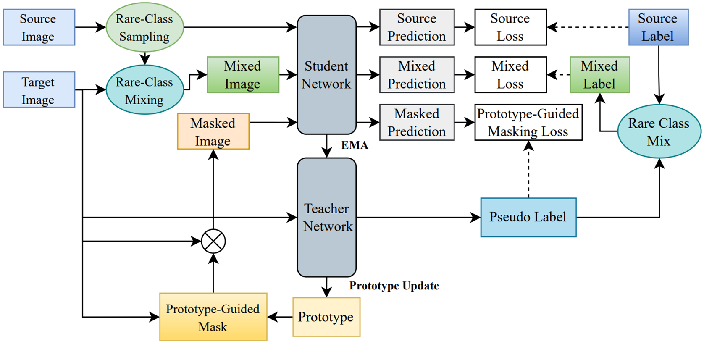
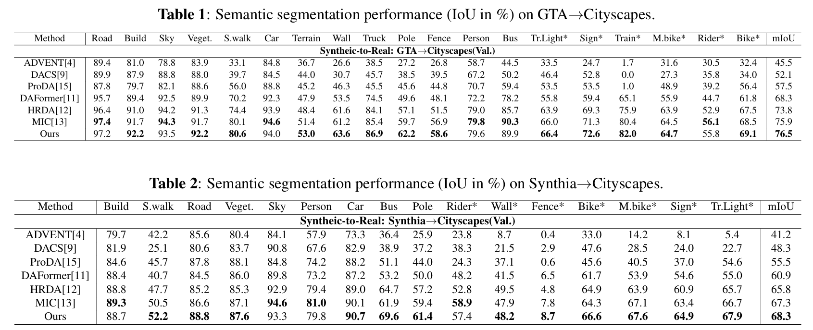

# Prototype-Guided Masking for Unsupervised Domain Adaptation

**by Kai-Wen Chen; Chen-Kuo Chiang**

**[[Paper]](https://ieeexplore.ieee.org/abstract/document/10447415)**

:bell: We are happy to announce that Prototype-Guided Masking for Unsupervised Domain Adaptation was accepted at **ICASSP24**. :bell:

## Overview
In the domain of Unsupervised Domain Adaptation (UDA), the training process leverages both labeled data from the source domain and unlabeled data from the target domain to facilitate the transfer of knowledge to the target domain. Previous UDA methods have sought to improve robust visual recognition by capitalizing on the consistency among masked images to learn spatial context relations. However, it is imperative to acknowledge that different regions within an image may hold varying degrees of significance across various recognition tasks. The conventional approach typically involves random masking to images, neglecting the evaluation of sample difficulty or ease during the model learning process. To tackle this challenge, we introduce a novel technique, called Prototype-Guided Masking, for semantic segmentation in this paper. It enforces deep models to concentrate on learning from more challenging regions, as opposed to dedicating excessive attention to samples that are easily distinguishable in the initial stages of training. A key component of this approach is the introduction of prototype confidence score, which is utilized to assess and selectively mask images. Experimental results demonstrate that the proposed Prototype-Guided Masking yields highly competitive outcomes when compared to state-of-the-art performance on benchmarks across multiple semantic segmentation datasets.

## Architecture

## Experimental Results

## Acknowledgements

This code is based on the following open-source projects. We thank their
authors for making the source code publicly available.

* [MIC](https://github.com/lhoyer/MIC)
